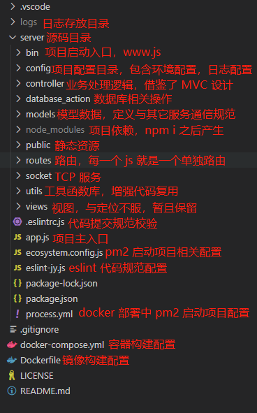

<!--
 * @Description: 
 * @Version: 1.0
 * @Autor: 林景恒
 * @Date: 2020-07-02 20:48:48
 * @LastEditors: Please set LastEditors
 * @LastEditTime: 2020-07-19 21:27:14
--> 
# 基于 Koa 框架搭建的后端服务

如果该项目对你有所帮助，麻烦给个小星星鼓励鼓励。

## 介绍

Koa 框架是由 Express 框架原班人马基于 ES6 新特性重新开发的框架，框架本身不包含任何的中间件，很多功能需要借助第三方插件加以实现。相较于 Express 框架而言，有如下一些差别：
1. Express 框架内置了许多中间件，而 Koa 没有；
2. Express 包含了路由，视图等特性，而 Koa 只有 HTTP 模块；
3. Express 的中间件模型是线型，而 Koa 的中间件模型是 U 型（也可称其为洋葱模型）；
4. Express 通过回调实现异步函数，在多个回调、多个中间件中写起来逻辑会相对混乱。Koa 通过 generator 和 async/await 使用同步写法来处理异步，直观明了。  
综上所述，Koa 相对于 Express 轻量，减少了回调的使用。在借助洋葱模型与 async/await，通过 next() 将中间件的执行顺序统一规划起来，即 async/await 保证了中间件的执行顺序，next() 将中间件划分上下两部分，优先执行 next() 执行的代码，这样，最终我们可以保证异步的同步化，逻辑清晰。

## 项目介绍

本项目是基于 Koa 进行开发的服务，可以将他用于中间层，对前端资源请求的转发或数据处理、缓存、消息通知等等，除此之外，该项目也可作为后端服务，给前端提供接口等等常规操作。在项目中，开放了两个端口，其中 3033 是接口监听端口，3022 是 TCP 服务监听端口，通过 3022 端口，可以接收来自硬件模块（4G模块、GPS模块等等）的消息，本质上是接住了 Node.js 中提供的 net 模块实现，这里通过 socket 与硬件保持通信。  

除了对接硬件消息之外，还提供了常规的后端服务，简单的 RPC 调用。

## 项目运行

```bash
# 拉取代码
git clone https://gitee.com/wu_lin_20200628/wxxcx_node.git

# 进入到 server 文件夹
npm i

# 运行项目
npm run start
```
## 如何生成 Koa 项目

一、Koa应用程序生成器安装  

```bash
npm install Koa-generator -g
```

二、一键生成Koa项目  

```bash
Koa2 wwxcx_node
npm install
```

## 项目部署

本项目部署可以直接部署，也可以通过 Docker 进行容器化部署，详细教程参考：[Docker系列总结](https://mp.weixin.qq.com/s/LdpOz5Cf35TwKC3psGyVPw)。

## 协同与参与开发

1.将远端项目同步到本地

```bash
git clone https://gitee.com/wu_lin_20200628/wxxcx_node.git
```

2.分支说明  
开发分支：feature/需求名称_分支创建日期_开发人  
测试分支：release/test  
上线分支：sx  
生成分支：master

3.代码规范  
规范工具：husky eslint  

```bash
npm install husky eslint --save-dev
```

两个重要文件：.eslintrc.js、eslint-jy.js  
package.json 文件配置  

```bash
"husky": {
    "hooks": {
        "pre-commit": "node ./eslint-jy.js"
    }
}
```

## 文件结构介绍

1.项目文件结构  
  

2.如何添加一个路由  
①：在 routes 文件夹中新增一个业务模块  
②：在 controller 文件夹中新增业务处理控制器  
③：在 models 文件夹中新增结果模型数据

## 开发需要注意的点
1.如果觉的可以复用的方法，建议在 utils 下新增 publice 相关的函数  
2.要注意代码规范

## 成员

项目创建人：林景恒  
